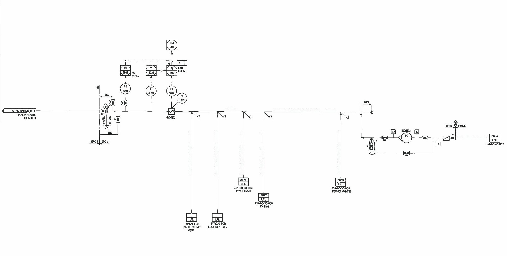

# 🛠️ P&ID Pipe Removal Project (Final Version)

Automatically removes connecting pipes from engineering P&ID diagrams using OpenCV, while preserving all critical symbols (valves, sensors, labels).

---

## 📅 Project Overview
This project was completed as part of an AI/ML software engineering assignment. The objective was to detect and remove connecting pipes from a P&ID (Piping and Instrumentation Diagram) while keeping all symbols intact. The final solution uses image processing techniques such as grayscale differencing, morphological operations, and inpainting.

---

## 📊 Results
| Original Diagram | Processed Output |
|------------------|------------------|
|  |  |

Pipe connections are removed, and all relevant symbols and texts are preserved with high accuracy.

---

## 🔄 How It Works
### Step-by-step Pipeline:
1. Load the original input image and the expected pipe-free version.
2. Convert both to grayscale and compute the pixel difference.
3. Generate a binary mask of the pipes using thresholding and dilation.
4. Apply OpenCV's `inpaint()` to cleanly remove the pipes.
5. Save both the final cleaned image and the generated pipe mask.

---

## 🔧 Technologies Used
| Library | Purpose |
|--------|---------|
| OpenCV | Image preprocessing & inpainting |
| NumPy  | Image data handling |
| Python | End-to-end implementation |

---

## 📁 Folder Structure
```
pipe_removal_pid_ai/
├── data/
│   ├── input.jpg                  # Original P&ID diagram
│   ├── nearest_expected_output.jpg # Clean reference for mask generation
│   └── final_output.jpg           # Output image with pipes removed
├── results/
│   └── mask_preview.png           # Binary pipe mask
├── generate_pipe_free_output.py   # Main script
├── README.md                      # Project documentation
```

---

## 🚀 How to Run
### Requirements:
```bash
pip install opencv-python numpy
```

### Run the Script:
```bash
python generate_pipe_free_output.py
```

This will:
- Generate `results/mask_preview.png`
- Generate `data/final_output.jpg`

---

## 🧑‍💻 Author
**Waseem Ibn Yousef CM**  
Calicut, Kerala, India  
📧 cmwaseemyousef@gmail.com  
📞 +91-9746460363  
[LinkedIn](https://linkedin.com/in/waseemibnyousefcm)

---

## 🚀 Showcase Ready
GitHub Repo: [https://github.com/cmwaseemyousef/pid-pipe-removal](https://github.com/cmwaseemyousef/pid-pipe-removal)

---

## 🎥 Video Demo (Script Outline)
1. **Intro**: "Hi, this is Waseem. Here's my AI project that removes pipes from P&ID diagrams."
2. **Problem**: "Engineers often need clean diagrams for automation and data extraction."
3. **Solution**: "I compare the original image with an expected clean version, generate a pipe mask, and use OpenCV to inpaint the pipes."
4. **Demo**: Screen record running the script and show before/after images.
5. **Outro**: "Thanks for watching! Visit my GitHub to explore the code."

---

## 🔗 License
This project is for educational and demonstration purposes only. Feel free to fork and improve.

